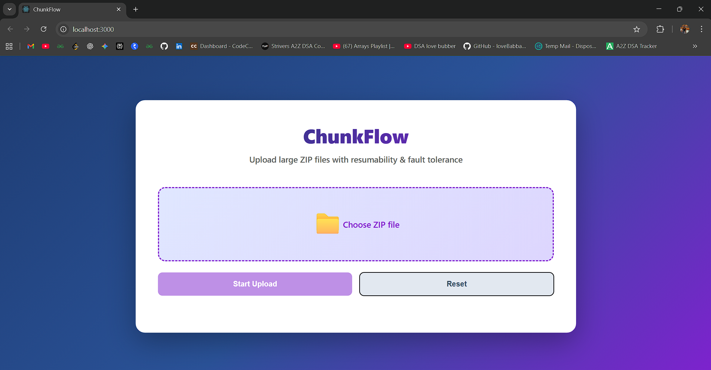
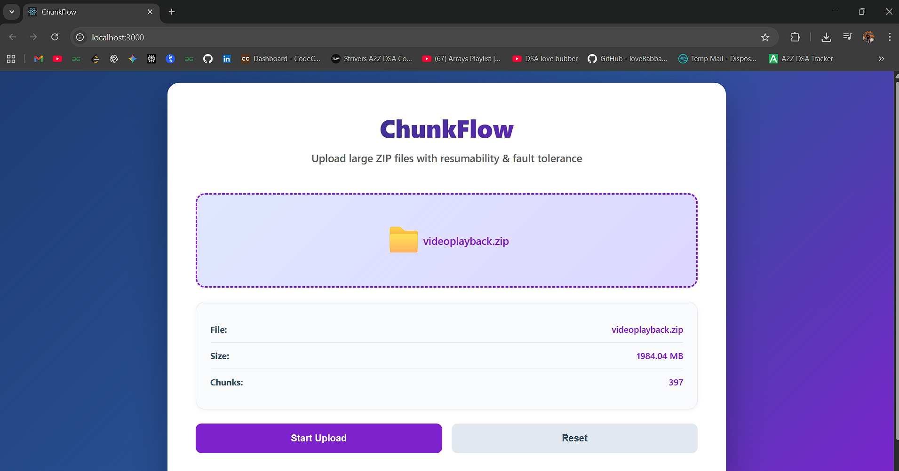
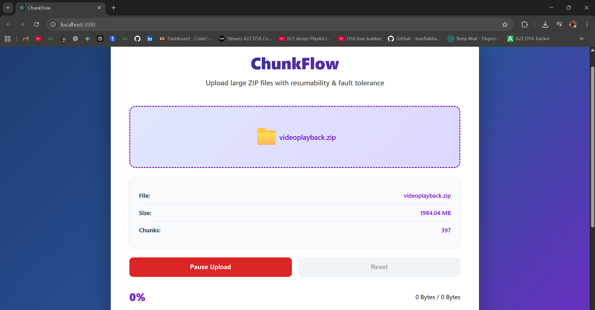
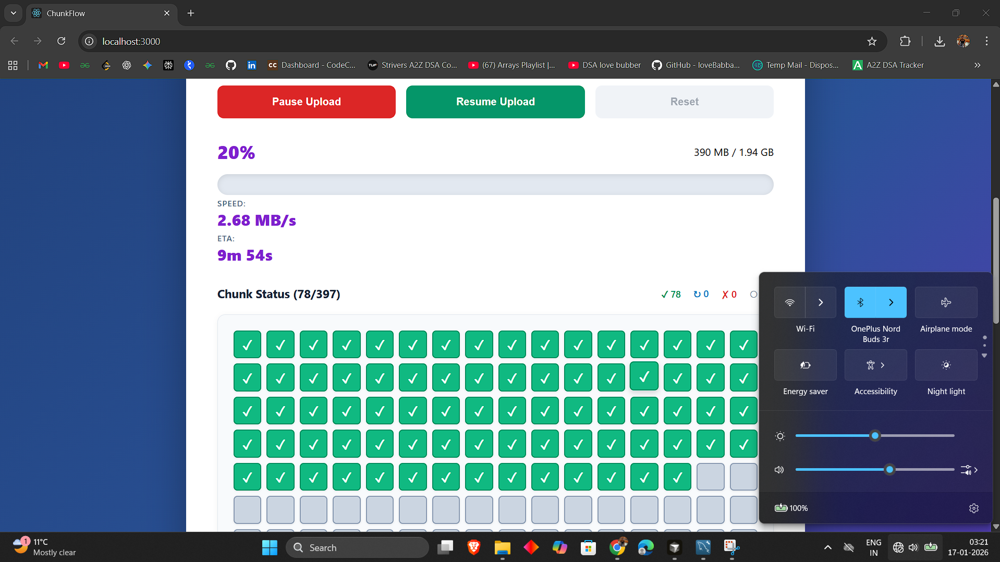
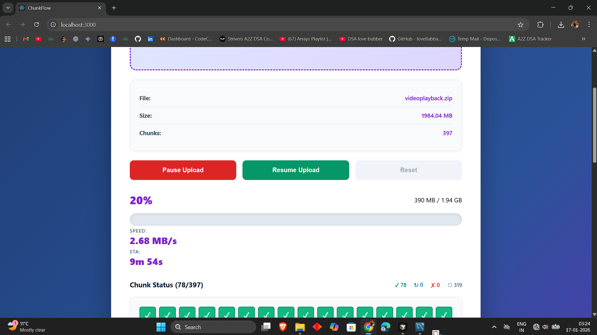
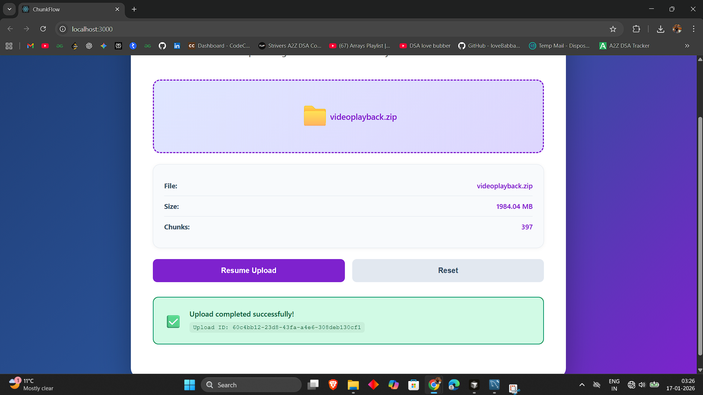

# ChunkFlow - Technical Documentation

A robust file upload system with chunking, resumability, and fault tolerance for large ZIP files.

---

## Screenshots

### Main Interface



*Clean and modern upload interface with real-time progress tracking*

### Upload in Progress

 (screenshots/3.png)

*Real-time progress bar showing upload speed, ETA, and completion percentage*

### Upload Start



*Starts the upload process and prepares files for efficient, chunk-based transfer.*

### Chunk Grid Visualization



*Visual representation of each 5MB chunk with color-coded status indicators*

### Pause and Resume



*Pause and resume functionality - pick up exactly where you left off*

### File Overview



*Quickly review uploaded files, their status, and essential details in a single view.*

---

## Contents

1. File Integrity and Hashing
2. Pause and Resume Logic
3. Known Trade-offs
4. Further Enhancements

---

## 1. File Integrity and Hashing

### How We Ensure Data Integrity

We use a four-layer approach to make sure your files don't get corrupted during upload. Each layer checks the data at different stages.

**Layer 1: Full File Hash (Before Upload Starts)**

- Calculate a unique fingerprint of your entire file using SHA-256
- Process the file in small 64KB pieces so it doesn't crash your browser
- Takes about 3 to 5 seconds for a 1GB file
- This gives us a reference point to verify everything later

**Layer 2: Individual Chunk Hashing (During Upload)**

- Split your file into 5MB chunks
- Calculate a hash for each chunk separately
- Send the hash along with the chunk data
- If one chunk fails, we only retry that specific chunk instead of the whole file

**Layer 3: Server-Side Verification (When Chunks Arrive)**

- Server recalculates the hash of each received chunk
- Compares it with the hash you sent
- Accepts the chunk if they match
- Rejects it if they don't match (probably got corrupted in transit)

**Layer 4: Final Check (After Everything is Uploaded)**

- Verify the complete file size matches what we expected
- Calculate the hash of the fully assembled file
- Check if the ZIP file structure is valid
- Store the final hash in the database for future reference

### Why Four Layers

Having multiple layers catches different types of problems:

- First layer catches issues before you waste time uploading
- Second layer lets us retry just the broken chunks
- Third layer catches network transmission errors
- Fourth layer makes sure the assembled file is actually usable

### The Complete Flow

```
Select file → Hash entire file → Break into chunks → 
Hash each chunk → Upload chunks one by one → 
Server verifies each chunk → All chunks done → 
Final verification → Upload complete
```


*Each colored box represents a 5MB chunk being verified and tracked*

---

## 2. Pause and Resume Logic


### How Pausing Works

When you click Pause, the system doesn't just kill everything. Here's what actually happens:

- Sets a flag that tells the system to stop queuing new chunks
- Lets currently uploading chunks finish (takes 2-5 seconds)
- Saves your upload ID and progress
- Shows you a Resume button

The backend database keeps track of every single chunk status, so even if you close your browser, we know exactly what's been uploaded.

### How Resuming Works

When you click Resume:

- System asks the backend which chunks are already uploaded
- Backend looks in the database and sends back a list
- Only the missing chunks get queued for upload
- Upload continues from where you left off

### What Gets Saved

**On Your Computer (Temporary)**
- Upload ID
- Whether it's paused or not
- Current progress percentage

**On the Server (Permanent)**
- Upload ID
- Complete list of which chunks succeeded
- File metadata (name, size, etc)
- Timestamps for everything

### Why This Design

We store the important stuff (chunk status) on the server because:

- It survives browser crashes
- It survives page refreshes
- It survives server restarts
- You can resume from any device with the upload ID

### Example Timeline

Day 1, 10:00 AM
- You start uploading a 1GB file
- Gets to 45% (90 out of 200 chunks done)

Day 1, 10:15 AM
- You click Pause
- Browser saves the upload ID
- Database knows chunks 0-89 are done

You close everything and go home

Day 2, 9:00 AM
- You come back and click Resume
- System checks: "Which chunks are done?"
- Server says: "Chunks 0-89 are good"
- System uploads only chunks 90-199
- Upload completes

---

## 3. Known Trade-offs

### Decision 1: Memory vs Speed in File Hashing

**What we chose:** Process files in 64KB increments

**The trade-off:**
- Speed: Moderate (3-5 seconds for 1GB)
- Memory: Very low (only 64KB needed)
- Works for any file size

**Why this choice:**
- Browsers can crash if you try to load a 5GB file into memory
- The 3-5 second delay is worth the reliability
- Mobile devices especially benefit from low memory usage

---

### Decision 2: How Many Chunks to Upload at Once

**What we chose:** Maximum 3 concurrent uploads

**The trade-off:**
- Uploading 10 at once would be faster
- But browsers limit you to 6 connections total
- We need some connections for other things (checking status, UI updates)

**Why this choice:**
- 3 concurrent gives you good speed
- Leaves room for other operations
- Doesn't overwhelm the server
- Works well on any network speed

---

### Decision 3: MySQL Instead of MongoDB

**What we chose:** Relational database (MySQL)

**The trade-off:**
- MySQL is harder to scale horizontally
- But it gives us strong data consistency
- We get proper transactions
- Complex queries are easier

**Why this choice:**
- We absolutely cannot lose track of which chunks are uploaded
- Transactions ensure either all records are saved or none are
- The relationships between uploads and chunks fit perfectly in SQL

---

### Decision 4: Where to Store the Pause Signal

**What we chose:** Keep it in memory (browser state)

**The trade-off:**
- Lost if you refresh the page
- But extremely simple to implement
- Fast with no storage overhead

**Why this choice:**
- Page refresh during active upload is rare
- Backend still tracks everything important
- You can always resume using the backend data
- Simplicity is valuable

---

### Decision 5: File Pre-allocation

**What we chose:** Reserve the full file size on disk before uploading

**The trade-off:**
- Wastes space if upload is abandoned
- But you know immediately if there's enough space

**Why this choice:**
- Better to fail fast than waste 20 minutes uploading only to run out of space
- Prevents fragmentation on disk
- Faster writes when chunks arrive
- We have a cleanup service to reclaim abandoned space

---

### Decision 6: Fixed 5MB Chunk Size

**What we chose:** All chunks are 5MB (except the last one)

**The trade-off:**
- Not optimal for very small files (less than 50MB)
- Not optimal for very large files (more than 10GB)
- But works well for everything in between

**Why this choice:**
- Simple to implement and test
- Industry standard (AWS and Google use 5-10MB)
- Predictable memory usage
- Good balance of retry cost vs number of requests

---

### Decision 7: Hash on Client Side

**What we chose:** Calculate hash in the browser before uploading

**The trade-off:**
- Adds 3-5 seconds before upload starts
- Uses your CPU and battery
- But distributes the work across users

**Why this choice:**
- Server can handle way more users this way
- 1000 users = 1000 CPUs doing the work, not one server
- Catch corruption early before wasting bandwidth
- Scales much better

---

## 4. Further Enhancements

### High Priority (Should do soon)

**1. Save Upload State in Browser Storage**

Problem: Lose progress if you refresh the page

Solution: Store upload info in localStorage

- Survives page refresh
- Survives browser crash
- Shows "Resume upload?" when you come back
- Takes about 3 hours to implement

**2. Upload Multiple Files at Once**

Problem: Can only upload one file at a time

Solution: Queue system with parallel processing

- Upload 3-5 files simultaneously
- Each file has its own progress bar
- Pause/resume individual files
- Queue additional files
- Takes 1-2 weeks to implement

**3. WebSockets for Real-time Updates**

Problem: Current system polls the server repeatedly

Solution: Two-way communication channel

- Server pushes updates instantly
- Reduces server load significantly
- Lower latency for progress updates
- Takes 3-5 days to implement

**4. Drag and Drop Interface**

Problem: Have to click and browse for files

Solution: Drop zone for files

- Drag files directly onto the page
- Modern and convenient
- Support multiple files at once
- Takes 1-2 days to implement

---

### Medium Priority (Nice to have)

**5. Detect Duplicate Files**

Problem: Same file gets uploaded multiple times

Solution: Check hash before uploading

- If file already exists, instant "upload"
- Saves storage space
- Saves bandwidth
- Takes 1 day to implement

**6. Compress Before Uploading**

Problem: Large files take forever on slow connections

Solution: Compress chunks before sending

- 30-50% smaller upload size
- Faster on slow networks
- Uses more CPU
- Takes 2-3 days to implement

**7. Scan for Viruses**

Problem: Malicious files could be uploaded

Solution: Integrate antivirus (ClamAV)

- Scan every uploaded file
- Quarantine infected files
- Security requirement for enterprise
- Takes 3-5 days to implement

---

### Lower Priority (Future possibilities)

**8. Cloud Storage Integration**

Upload directly to AWS S3 or Google Cloud instead of your own server. Would need to generate signed URLs and let browser upload directly. Very scalable but complex to implement. Estimated 2-3 weeks.

**9. End-to-End Encryption**

Encrypt files before upload so server can't read them. Good for privacy and compliance. Client holds the encryption key. Complex implementation, about 2-3 weeks.

**10. Mobile App**

Native iOS and Android app with background uploads and push notifications. Major project, would take 2-3 months.

**11. Upload Speed Limiting**

Let users cap their upload speed so they don't saturate their connection. Useful for uploading in the background while doing other things. Medium complexity, about 1 week.

**12. Analytics Dashboard**

Track upload statistics, success rates, average speeds, peak times, etc. Useful for monitoring system health. About 1 week for basic version.

---

## Summary

**File Integrity:** Four layers of SHA-256 hashing catch corruption at every stage

**Pause and Resume:** Database tracks everything, so you can stop and continue anytime

**Trade-offs:** We chose reliability over speed, simplicity over features, and user experience over technical perfection

**Enhancements:** Plenty of room to grow with features like multi-file upload, cloud storage, and real-time updates

---

Built with React (frontend), Node.js + Express (backend), and MySQL (database)
